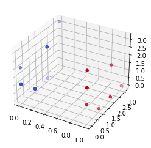

# qhack21 - Quant'ronauts
Team repository for QHACK21, I'll change the name when we'll have a proper team name

## Table of contents
1. [Structure](#structure)
2. [Idea](#idea)
3. [Setup env](#setup_env)

## Structure <a name="structure"></a>
- main : only for archive and tag
- develop : for merging and testing everything together
- feature : to develop things

## Idea <a name="idea"></a>
### First create quantum state with variational parameters
- We need to create quantum state using variational circuit, example :
<pre>
        |----------|  |----------------------|
	|  Device  |  |      Processing      |    
        | |------| |  | |-------|  |-------| |      |---------|
  |0> --|-| S(x) |-|--|-| RX(y) |--| RZ(y) |-|------| MEASURE |
        | |------| |  | |-------|  |-------| |      |---------|
  	|----------|  |----------------------|           |
  c0   --------------------------------------------------o-----
</pre>
1. We generated 100 *x* (format like *(X ; Z) --> (π/3 ; 2π/3)*) values labed to be Qat or DoQ
2. Then run it for each *x* value
3. Adjust *y* along the gradient (as PennyLane can calculate the [gradient](https://medium.com/xanaduai/training-quantum-neural-networks-with-pennylane-pytorch-and-tensorflow-c669108118cc) w.r.t. y)
4. Redo step 2 and 3 again and again and again ...

#### Register output with parameters and making graph state
<table>
	<tbody>
		<tr>
			<td>
				
				<br/><b>Legends :</b>
				<ul>
					<li>Blue : <i>Qats</i></li>
					<li>Red : <i>DoQs</i></li>
				</ul>
			</td>
			<td>
				<table>
					<thead>
						<tr>
							<th align="center">RX</th>
							<th align="center">RZ</th>
							<th align="center">OUT</th>
						</tr>
					</thead>
					<tbody>
						<tr>
							<td align="center">π</td>
							<td align="center">0</td>
							<td align="center">1</td>
						</tr>
						<tr>
							<td align="center">π/3</td>
							<td align="center">0</td>
							<td align="center">0</td>
						</tr>
						<tr>
							<td align="center">π/3</td>
							<td align="center">0</td>
							<td align="center">1</td>
						</tr>
						<tr>
							<td align="center">π/3</td>
							<td align="center">0</td>
							<td align="center">0</td>
						</tr>
						<tr>
							<td align="center">0</td>
							<td align="center">2*π/3</td>
							<td align="center">1</td>
						</tr>
						<tr>
							<td align="center">0</td>
							<td align="center">2*π/3</td>
							<td align="center">1</td>
						</tr>
						<tr>
							<td align="center">0</td>
							<td align="center">2*π/3</td>
							<td align="center">0</td>
						</tr>
						<tr>
							<td align="center">2*π/3</td>
							<td align="center">2*π/3</td>
							<td align="center">1</td>
						</tr>
						<tr>
							<td align="center">2*π/3</td>
							<td align="center">2*π/3</td>
							<td align="center">0</td>
						</tr>
						<tr>
							<td align="center">2*π/3</td>
							<td align="center">2*π/3</td>
							<td align="center">0</td>
						</tr>
						<tr>
							<td align="center">2*π/3</td>
							<td align="center">π/3</td>
							<td align="center">1</td>
						</tr>
						<tr>
							<td align="center">2*π/3</td>
							<td align="center">π/3</td>
							<td align="center">0</td>
						</tr>
						<tr>
							<td align="center">2*π/3</td>
							<td align="center">π/3</td>
							<td align="center">1</td>
						</tr>
						<tr>
							<td align="center">...</td>
							<td align="center">...</td>
							<td align="center">...</td>
						</tr>
					</tbody>
				</table>
			</td>
		</tr>
	</tbody>
</table>

## Setup env <a name="setup_env"></a>
### Create your virtual env
- To create your virtual env I suggested to use [Anaconda](https://www.anaconda.com/products/individual)
	- If you are on Linux you can setup your virtual env by using :
		- <details><summary>Linux env</summary>
			<pre>
			toto$ ( echo; echo '##### added for quantum #####';
			echo 'export PATH=/home/toto/.local/bin:$PATH';
			echo "alias quantum='source ~/quantum/bin/activate'" ) >> ~/.bashrc
			toto$ . ~/.bashrc
			toto$ pip3 install --upgrade pip
			toto$ python3 -m pip install virtualenv
			toto$ python3 -m virtualenv quantum
			toto$ quantum
			</pre>
		</details>

- Inside your env, check your python installation :
```
conda activate name_of_my_env
python --version
```
- :warning: Be careful some quantum libs have problem with :x: **python 3.9**, so stop yourself to **[python 3.8](https://www.python.org/downloads/release/python-387/)** :
`pip install python==3.8.7`

### Installing libraries
To run our project you'll need a bunch of libraries, to installed them run the following command :
```
pip install pennylane
pip install pennylane-qiskit
pip install pennylane-sf

# For numpy install the following lib
pip install autograd
pip install torch torchvision
```
In case you have python 2.x and python 3.x cohabited on your virtual system, use `pip3` instead of `pip`
