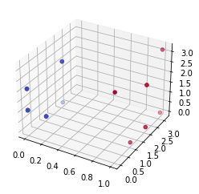

# Qats & DoQs
- Classifier of quantum cats and quantum dogs

## Structure 
- Folders :
	- datas : folder for the Qats and DoQs csv files
	- devices : folder for the differents device (quantum generation)
	- classifiers : folder for the differents classifiers
	- combine : folder for the differents combining algorithms
	- training : folder for the differents training algorithms
	- testing : folder for the differents testing algorithms
	- graphs : folder fo rthe differents graphs generation
	- communication : folder for images and ressources to present the project

## Idea 
### First create quantum state with variational parameters
- We need to create quantum state using variational circuit, example :
<pre>
        |----------|  |----------------------|
	|  Device  |  |      Processing      |    
        | |------| |  | |-------|  |-------| |      |---------|
  |0> --|-| S(x) |-|--|-| RX(y) |--| RY(y) |-|------| MEASURE |
        | |------| |  | |-------|  |-------| |      |---------|
  	|----------|  |----------------------|           |
  c0   --------------------------------------------------o-----
</pre>
1. We generated 100 *x* (format like *(X ; Z) --> (π/3 ; 2π/3)*) values labed to be Qat or DoQ
2. Then run it for each *x* value
3. Adjust *y* along the gradient (as PennyLane can calculate the [gradient](https://medium.com/xanaduai/training-quantum-neural-networks-with-pennylane-pytorch-and-tensorflow-c669108118cc) w.r.t. y)
4. Redo step 2 and 3 again and again and again ...

#### Register output with parameters and making graph state
<table>
	<tbody>
		<tr>
			<td>
				
				 <b>Legends :</b>
				<ul>
					<li>Blue : <i>Qats</i></li>
					<li>Red : <i>DoQs</i></li>
				</ul>
			</td>
			<td>
				<table>
					<thead>
						<tr>
							<th align="center">RX(<i>x</i>)</th>
							<th align="center">RZ(<i>x</i>)</th>
							<th align="center">OUT</th>
						</tr>
					</thead>
					<tbody>
						<tr>
							<td align="center">π</td>
							<td align="center">0</td>
							<td align="center">1</td>
						</tr>
						<tr>
							<td align="center">π/3</td>
							<td align="center">0</td>
							<td align="center">0</td>
						</tr>
						<tr>
							<td align="center">π/3</td>
							<td align="center">0</td>
							<td align="center">1</td>
						</tr>
						<tr>
							<td align="center">π/3</td>
							<td align="center">0</td>
							<td align="center">0</td>
						</tr>
						<tr>
							<td align="center">0</td>
							<td align="center">2*π/3</td>
							<td align="center">0</td>
						</tr>
						<tr>
							<td align="center">2*π/3</td>
							<td align="center">2*π/3</td>
							<td align="center">1</td>
						</tr>
						<tr>
							<td align="center">2*π/3</td>
							<td align="center">2*π/3</td>
							<td align="center">1</td>
						</tr>
						<tr>
							<td align="center">2*π/3</td>
							<td align="center">2*π/3</td>
							<td align="center">0</td>
						</tr>
						<tr>
							<td align="center">2*π/3</td>
							<td align="center">π/3</td>
							<td align="center">1</td>
						</tr>
						<tr>
							<td align="center">2*π/3</td>
							<td align="center">π/3</td>
							<td align="center">0</td>
						</tr>
						<tr>
							<td align="center">2*π/3</td>
							<td align="center">π/3</td>
							<td align="center">1</td>
						</tr>
						<tr>
							<td align="center">...</td>
							<td align="center">...</td>
							<td align="center">...</td>
						</tr>
					</tbody>
				</table>
			</td>
		</tr>
	</tbody>
</table>
